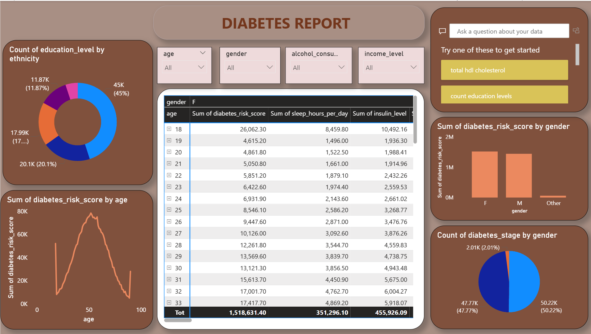

# Decode-Diabetes

A comprehensive data analytics dashboard built to uncover insights into diabetes trends across different demographic and lifestyle factors. This project leverages advanced data visualization techniques to analyze risk factors, age distribution, education levels, and gender-based differences related to diabetes.

## Overview
Decode-Diabetes is an interactive analytics report designed to make sense of complex diabetes datasets. It helps healthcare analysts, researchers, and policymakers identify patterns and correlations between factors such as age, gender, ethnicity, education, alcohol consumption, and income level.

By combining visual analytics with statistical aggregation, this project provides a holistic understanding of diabetes prevalence, risk distribution, and lifestyle influences.

## Features

### 🩺 Key Visual Insights
- **Diabetes Risk by Age**: Visual representation of how diabetes risk fluctuates across different age groups. The peak risk lies around middle age, tapering off towards younger and older populations.

- **Risk Comparison by Gender**: Displays comparative risk scores between males, females, and other genders.

- **Education vs Ethnicity Correlation**: Examines how education levels vary across ethnic groups and their potential impact on diabetes risk.

- **Diabetes Stage Distribution**: Pie chart showing the proportion of individuals across different diabetes stages, segmented by gender.

### 📊 Interactive Filtering
- **Dynamic Filters** for age, gender, alcohol consumption, and income level allow users to focus on specific population subsets.

- **Instant recalculation** of metrics across all visuals for personalized exploration.

### 🧠 Analytical Highlights
- Correlation analysis between sleep hours, insulin levels, and diabetes risk scores.

- Aggregated metrics showing total insulin levels, sleep duration, and average risk scores across demographics.

- Data-driven insights that can help in preventive care planning and public health policy design.

## Videos
### Demo

